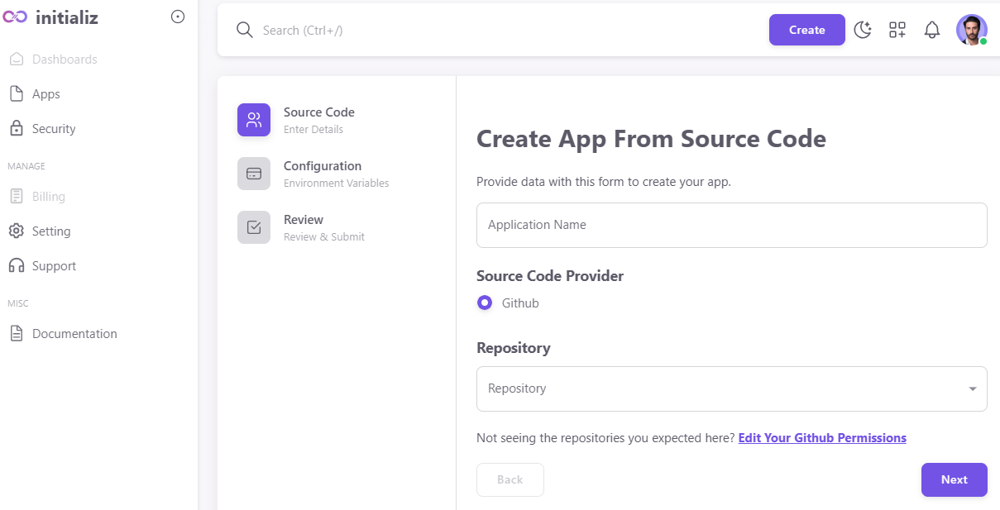
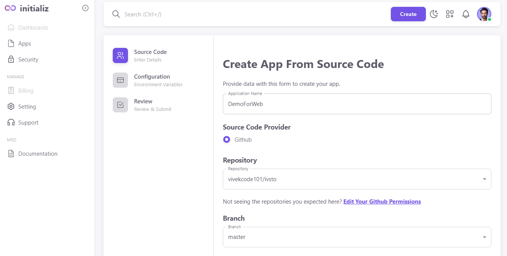
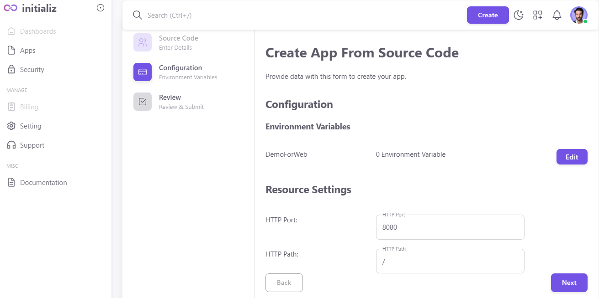
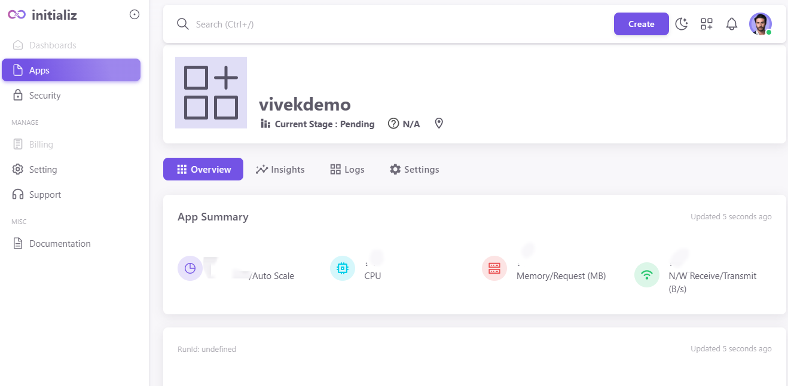

## Getting Started

We provide a sample app using React that you can deploy on App Platform. These steps will get this sample application running for you using App Platform.

**Note: Following these steps may result in charges for the use of Initializ services.**

### Requirements

* You need a Initializ account. If you don't already have one, you can sign up at [signup](https://console.initializ.ai/register/)

##  Create an App

- Click on the **Create App** button located on the top left of the dashboard.

##  Authorize Your GitHub Repo

- Connect your GitHub repository by authorizing access.

##  Give Name to the App

- Provide a name for your app during the creation process.

##  Select the Repositories

- Choose the specific repositories from your GitHub account.

##  Configure Environment Variables and Ports

- Set up environment variables and configure port settings as needed.

##  Click on Next

- Proceed to the next step in the creation process.

##  App Creation

- Wait for a short amount of time as your app is being created.

Once deployed, find your app at the URL displayed on the app's **Overview** page.